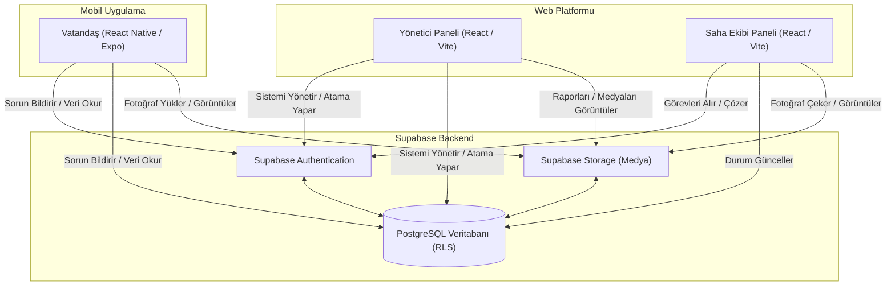

# SmartCity - Akıllı Şehir Sorun Bildirim ve Yönetim Sistemi

## Proje Özeti
SmartCity, vatandaşların şehirlerindeki altyapı, temizlik, güvenlik ve diğer kamusal sorunları kolayca bildirebildiği, yerel yönetimlerin (Yönetici ve Saha Ekipleri) ise bu bildirimleri tek bir merkezden yönetip çözüme kavuşturduğu kapsamlı bir web ve mobil tabanlı platformdur.

## Kullanılan Teknolojiler (Tech Stack)
- **Frontend (Web):** React, TypeScript, Vite, Tailwind CSS
- **Frontend (Mobil):** React Native (Expo), TypeScript, NativeWind
- **Backend & Veritabanı:** Supabase (PostgreSQL, RLS (Row Level Security), Authentication, Storage)
- **CI/CD:** GitHub Actions

## Temel Özellikler
- **Rol Tabanlı Erişim (RBAC):** Vatandaş, Saha Ekibi ve Yönetici olmak üzere farklı kullanıcı rolleri için özelleştirilmiş arayüzler ve yetkiler.
- **Çevrimdışı Mod (Offline-first):** Mobil uygulamada internet bağlantısı koptuğunda dahi sorunları listeleyebilme, AsyncStorage tabanlı önbellekleme mekanizması.
- **Karanlık Tema (Dark Mode):** Tüm platformlarda desteklenen karanlık mod seçeneği.
- **Performans Optimizasyonları:** `FlatList` ile büyük veri listelerinin verimli render edilmesi, `React.memo`, `useMemo` ve `useCallback` ile gereksiz yeniden çizimlerin (re-render) engellenmesi, Pagination (Sayfalama) desteği.
- **Hata Toleransı (Error Resilience):** Error Boundary kullanımı, asenkron işlemlerde Timeout yönetimi, görseller için Fallback Image desteği.

## Sistem Mimarisi

Aşağıdaki şemada SmartCity platformunun sistem mimarisi ve veri akışı gösterilmektedir:



## Kurulum ve Çalıştırma Rehberi

Projeyi yerel ortamınızda çalıştırmak için aşağıdaki adımları izleyebilirsiniz.

### 1. Supabase Yapılandırması
Hem `web/` hem de `mobile/` dizinlerinde `.env` (veya `.env.local`) dosyası oluşturarak Supabase bilgilerinizi girmeniz gerekmektedir:

```env
EXPO_PUBLIC_SUPABASE_URL=your_supabase_url
EXPO_PUBLIC_SUPABASE_ANON_KEY=your_supabase_anon_key
```

### 2. Web Projesi Kurulumu (Yönetici ve Saha Ekibi)

```bash
cd web
# Bağımlılıkları yükleyin
npm install

# Geliştirme sunucusunu başlatın
npm run dev
```

### 3. Mobil Projesi Kurulumu (Vatandaş)

```bash
cd mobile
# Bağımlılıkları yükleyin
npm install

# Expo geliştirme sunucusunu başlatın
npx expo start
```
